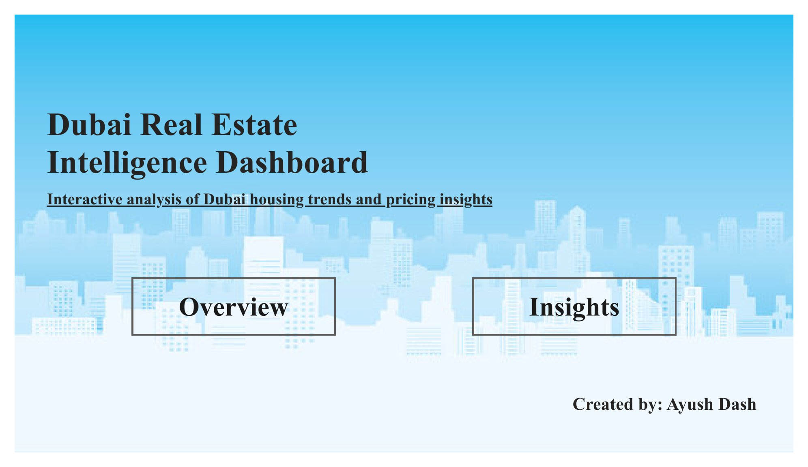
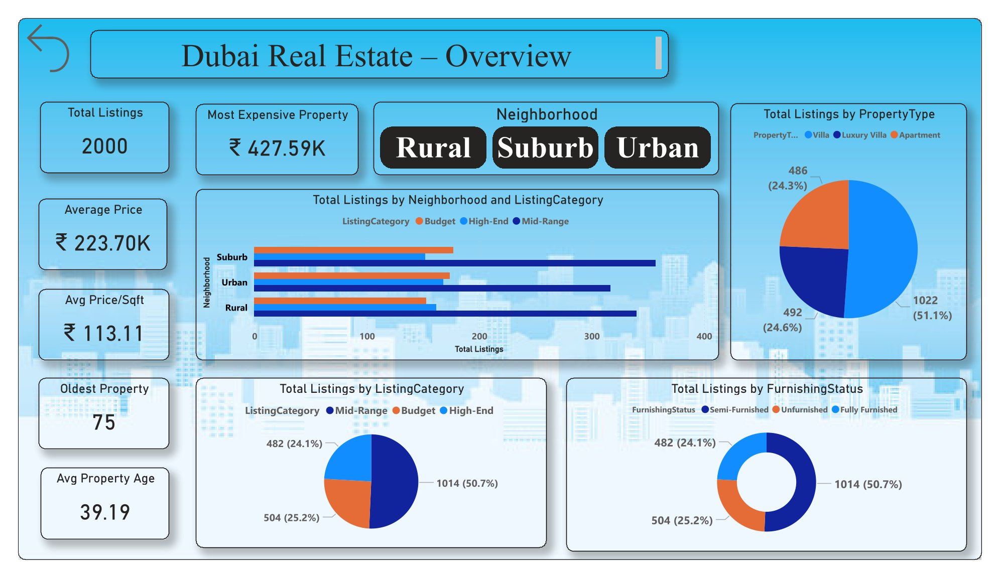
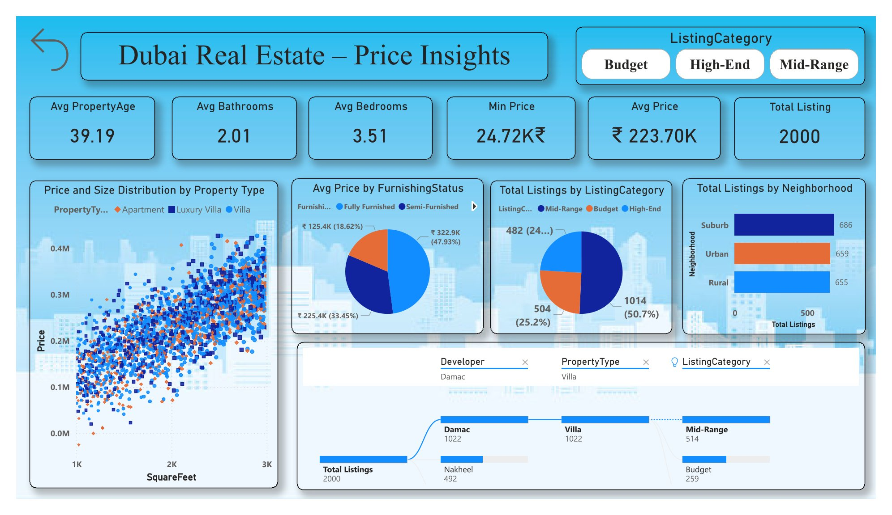

# Dubai Real Estate Intelligence Dashboard

Power BI Project | Data Analytics | April 2026

---

## 1. Project Overview

The Dubai Real Estate Intelligence Dashboard is an interactive Power BI solution developed to analyze housing data and generate insights into pricing trends, property characteristics, and market distribution.

This project demonstrates the use of data visualization and business intelligence tools to support informed decision-making for investors, real estate professionals, and policymakers.

---

## 2. Objectives

- Analyze property pricing trends  
- Identify high-value neighborhoods  
- Compare property types and furnishing status  
- Understand market segmentation  

---

## 3. Dataset

The dataset used in this project contains:

- SquareFeet  
- Bedrooms  
- Bathrooms  
- Neighborhood  
- YearBuilt  
- Price  

File: [Download Dataset](housing_price_dataset.csv)

---

## 4. Data Preparation

Data cleaning and transformation were performed using Power Query and DAX:

- Removed missing and duplicate values  
- Converted data types  
- Created calculated columns:

PricePerSqft = DIVIDE([Price], [SquareFeet])  
PropertyAge = 2025 - [YearBuilt]  

---

## 5. Dashboard Features

### Key Performance Indicators (KPIs)

- Total Listings  
- Average Price  
- Average Price per Sqft  
- Most Expensive Property  
- Property Age  

### Visualizations

- Scatter Chart: Price vs Property Size  
- Bar Chart: Neighborhood Analysis  
- Pie Chart: Listing Category Distribution  
- Donut Chart: Furnishing Status Analysis  
- Tree Map: Developer vs Property Type  
- Decomposition Tree: Detailed Breakdown  

---

## 6. Dashboard Preview

### Home Page

### Overview Page

### Insights Page

---

## 7. Key Insights

- Property prices increase with size  
- Premium locations have higher pricing  
- Apartments dominate the number of listings  
- Villas contribute to high-value properties  
- Furnishing status influences pricing  

---

## 8. Business Recommendations

- Invest in premium neighborhoods  
- Consider mid-range properties for affordability  
- Developers should focus on luxury housing  
- Monitor real estate trends continuously  

---

## 9. Tools and Technologies

- Power BI  
- DAX (Data Analysis Expressions)  
- Power Query  
- CSV Dataset  

---

## 10. Author

Ayush Dash  

---

## 11. License

This project is created for academic and learning purposes.
